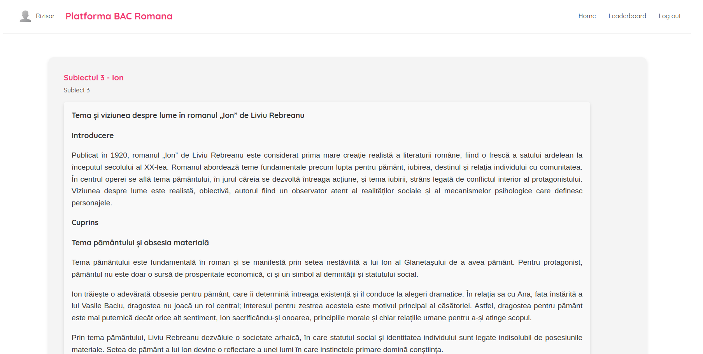
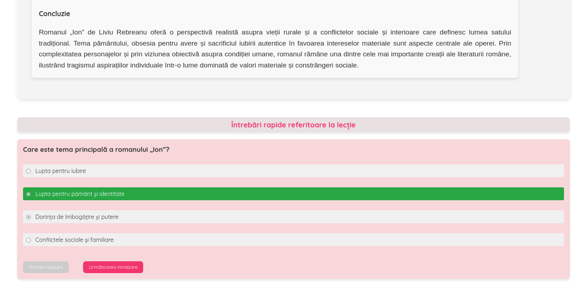
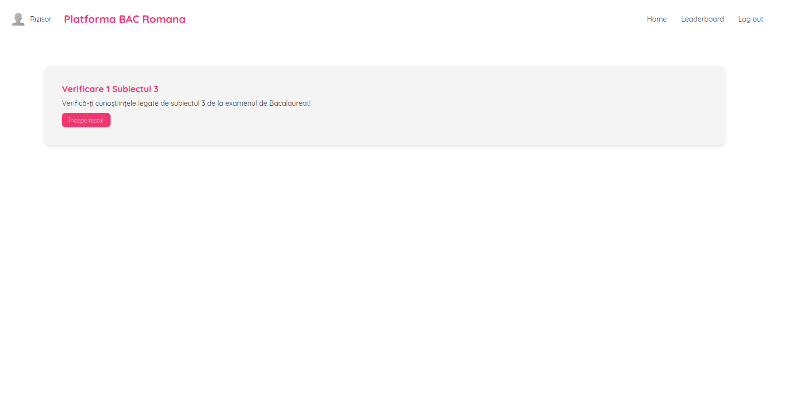
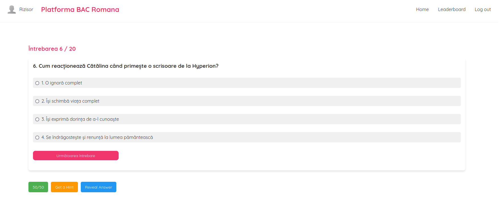
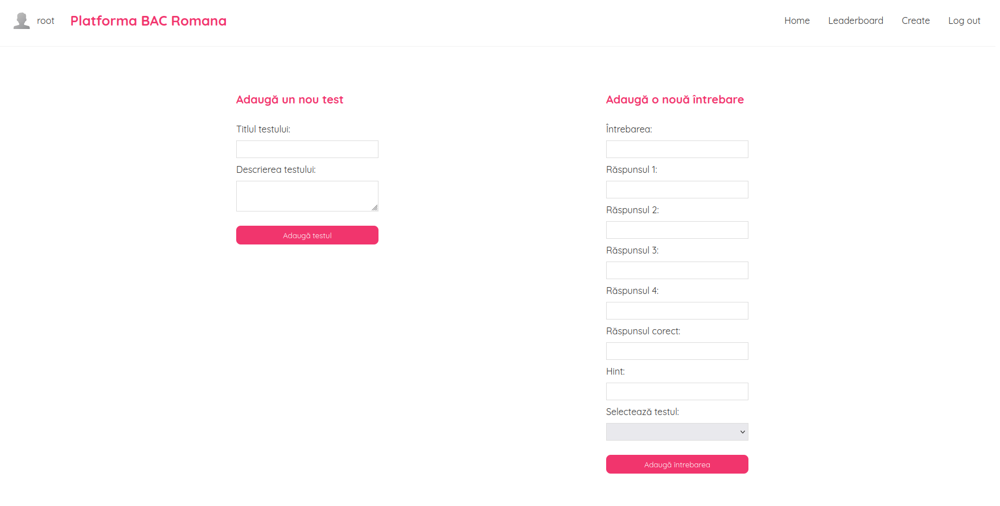
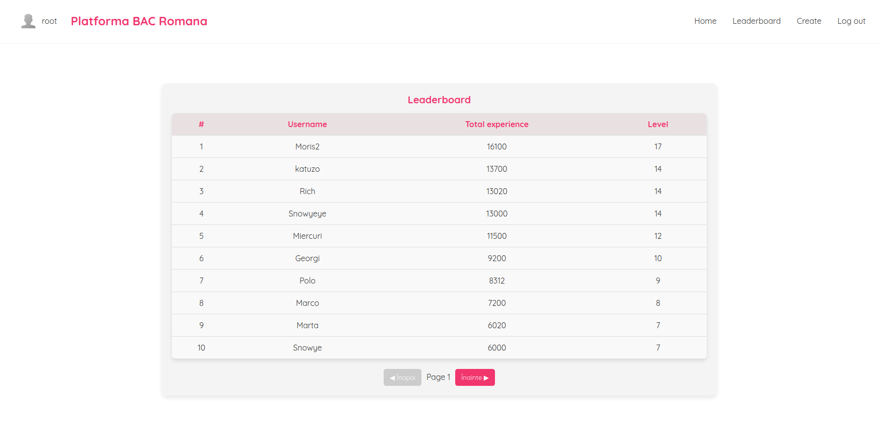

# Exam learning platform

  Project description 📚

 
A platform to create your own lessons and tests. Currently it is set up with materials for the romanian Bacalaureat exam at the Romanian language.

 

  Developer 🙆‍♂️

 
- Alex Roman

 

  Project implementation 🔧

 
I started this project to develop a web project with Go on the backend and Typescript + React on the frontend. The first step was implementing a few api's on
the server to create, update and delete users for the authentification. After having the users down, I wanted to be able to add lessons interactively through the
platform. Similarly I added tests. Quick questions for each lesson: after creating a lesson, you can publish as many quick questions in relation with the said lesson
that will appear directly under the lesson and will be randomized for the user to practice their knowledge on the subject. Using the same concept, I made it so you
have to create a test first, then you can add questions and select to with test they should be related to. This will add the question to the test. The last and
I think the most fun part, the gamification. Quick questions will give you experience points and gold and passing tests will also give you rewards. The experience
will place the users higher on the global leaderboard and the gold can be spent for advantages during tests. Lastly, I implemented badges for the user's profile, as
a cute addition and a sense of progress for the learner.

 

  Technologies ⚙️

 
**I chose Golang as the language for the backend**
- It is blazingly fast.
- It scales better than other options.
- Writing *Go* feels good.
- **Fiber**
- Easy to start with.
- Intuitive
- **Xorm + Sqlite**
- I used Xorm to handle the database.
- Sqlite was easy enough to set up and it gave me everything I need as fast as I needed it.

**Typescript for the frondend**
- Some form of static types were a must for me
- **Node**
- Developed ecosystem
- More than enough documentation
- **React**
- Personal preference, it was my first project with React and I just wanted to try using it and see how I like it.

 

 Media 📸 + Code 🖥️

  <blockquote>
  

&nbsp;&nbsp;&nbsp;&nbsp;Screenshots: 

  
  &nbsp;&nbsp;&nbsp;&nbsp;&nbsp;&nbsp;&nbsp;&nbsp;&nbsp;&nbsp;&nbsp;&nbsp;&nbsp;&nbsp;&nbsp;&nbsp;&nbsp;&nbsp;&nbsp;&nbsp;&nbsp;&nbsp;&nbsp;&nbsp;&nbsp;
  
  &nbsp;&nbsp;&nbsp;&nbsp;&nbsp;&nbsp;&nbsp;&nbsp;&nbsp;&nbsp;&nbsp;&nbsp;&nbsp;&nbsp;&nbsp;&nbsp;&nbsp;&nbsp;&nbsp;&nbsp;&nbsp;&nbsp;&nbsp;&nbsp;&nbsp;
  
  &nbsp;&nbsp;&nbsp;&nbsp;&nbsp;&nbsp;&nbsp;&nbsp;&nbsp;&nbsp;&nbsp;&nbsp;&nbsp;&nbsp;&nbsp;&nbsp;&nbsp;&nbsp;&nbsp;&nbsp;&nbsp;&nbsp;&nbsp;&nbsp;&nbsp;
   
  
  &nbsp;&nbsp;&nbsp;&nbsp;&nbsp;&nbsp;&nbsp;&nbsp;&nbsp;&nbsp;&nbsp;&nbsp;&nbsp;&nbsp;&nbsp;&nbsp;&nbsp;&nbsp;&nbsp;&nbsp;&nbsp;&nbsp;&nbsp;&nbsp;&nbsp;
  
  &nbsp;&nbsp;&nbsp;&nbsp;&nbsp;&nbsp;&nbsp;&nbsp;&nbsp;&nbsp;&nbsp;&nbsp;&nbsp;&nbsp;&nbsp;&nbsp;&nbsp;&nbsp;&nbsp;&nbsp;&nbsp;&nbsp;&nbsp;&nbsp;&nbsp;
  

  

  </blockquote>
   
  
  <blockquote>
  

&nbsp;&nbsp;&nbsp;&nbsp;Code: 

[Code file](https://github.com/ralexgt/Platforma-BAC/tree/main/server) - Server  
[Code file](https://github.com/ralexgt/Platforma-BAC/tree/main/platforma-romana) - UI

  

  </blockquote>
   

  <blockquote>
  

&nbsp;&nbsp;&nbsp;&nbsp;Fun fact: 

  <strong>I learned using the Helix text editor during this project. 😁 Still no neovim chad though. 🤣🤣

  

  </blockquote>

